# Ferrari F1 Interactive 3D Showcase

An interactive 3D automotive showroom and engineering visualization of a modern Formula 1 car, rendered in real time in the browser using Three.js and WebGL.

Designed as a cinematic automotive studio piece, this showcase presents a modern Formula 1 vehicle in a calibrated showroom environment with authentic PBR material separation, studio lighting rigs, 8 professional camera presets, and interactive presentation tools.

---

## Hero Showcase

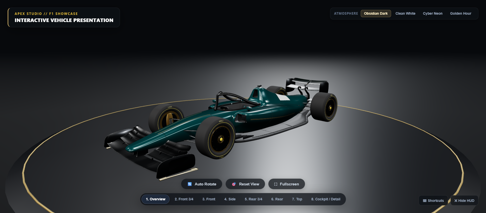

---

## Authoritative Livery & Materials

The vehicle features a permanent, bespoke motorsport livery engineered with authentic Physically Based Rendering (PBR), metallic shader extensions, and dual-layer clearcoat responses:

- **Deep Emerald Teal Body Paint (`#094547`):** Deep, rich racing teal metallic with controlled specular highlights, realistic metallic fleck response, and high-gloss automotive lacquer (`roughness: 0.18`, `metalness: 0.38`, `clearcoat: 1.0`).
- **Glossy Aerodynamic Carbon Weave (`#08090b`):** Dual-layer clearcoat carbon on front wing lower planes, pylons, and rear wing endplate assemblies.
- **Deep Dark Teal Carbon (`#0a1614`):** High-downforce dual rear wing aerofoils and beam wing.
- **Dark Satin Carbon Halo (`#0c0e10`):** Driver safety cell structure finished in matte satin carbon fiber.
- **Matte Structural Carbon:** Satin-finish underbody ground-effect floor, front splitter, side skirts, suspension wishbones, and 4 vertical rear diffuser strakes.
- **Aero Disc Wheel Covers (`#070809`):** Satin black carbon aerodynamic disc wheel covers with Pirelli P-Zero tire compounds and tire sidewall branding.
- **Crisp Silver-White Livery Swoops (`#f0f3f6`):** Dynamic sidepod undercut and engine cover downwash graphics.
- **Champagne Bronze / Gold Metallic Rims (`#bfa15f`):** Machined forged alloy wheel rim outer lips (`metalness: 0.90`, `roughness: 0.20`).
- **Metallic Gold Wheel Center Hub Nuts (`#d4af37`):** High-reflectivity center locking wheel nuts.
- **Mechanical Actuators (`#c5a059`):** Champagne gold metallic DRS pivot mechanism and mechanical linkages.
- **Precision Procedural Gold Racing Stripe System (`[0.75, 0.63, 0.37]`):**
  - **Nose / Monocoque:** Dual longitudinal accent lines following the aerodynamic shoulder crease of the nose cone.
  - **Front Wing Outer Trim:** Metallic gold accent on outer footplate runners and endplate vertical trim.
  - **Sidepod Sweep:** Dynamic sweeping contour following the sidepod downwash undercut from intake to coke-bottle section.
  - **Floor Edge:** Subtle pinstripe highlighting the outer carbon ground-effect floor edge.
  - **Rear Continuation:** Flank accent continuing smoothly toward the rear gearbox cowl.
- **Showroom Stage Dais:** Beveled circular dark granite plinth (radius 4.1m) surrounded by a restrained Champagne Gold metallic accent ring (`#bfa15f`, emissive `0x221a0a`).

---

## Interactive Features

- **8 Calibrated Camera Presets:** Instant smooth animated transitions between 8 studio camera positions calibrated after professional automotive studio photography.
- **4 Studio Atmospheres (Lighting Environments):** Dynamic runtime switching between Obsidian Dark Studio, Clean White Cyc, Cyber Neon, and Golden Hour.
- **Turntable Auto-Rotation:** Smooth 360-degree turntable presentation with automatic interaction pause and seamless resume.
- **Automotive Studio HUD:** Responsive glassmorphic interface with lighting switcher, action buttons, camera dock, and keyboard shortcut hints.
- **Clean Photography Mode:** One-click HUD toggle (`H`) to conceal all UI elements for clean photography and screenshot capture.
- **Responsive Viewport:** Adapts smoothly across desktop monitors, tablets, and mobile devices.

---

## Technology Stack

- **Three.js (`^0.160.0`):** Core WebGL rendering engine, scene graph, materials, and lighting.
- **Three.js Addons:** `OrbitControls`, `GLTFLoader`, `RoomEnvironment`, `BufferGeometryUtils`.
- **Custom PBR Shader Extensions:** Three.js `onBeforeCompile` vertex and fragment shader injection for coordinate-aware procedural livery striping.
- **HTML5 & CSS3:** Semantic glassmorphic HUD overlay with CSS custom properties, backdrop blur filters, and responsive layout.
- **Native ES Modules:** Clean modular JavaScript architecture without runtime bundler lock-in.
- **Node.js Pipeline:** Custom production build (`scripts/build.js`) and forensic lint validator (`scripts/lint.js`).

---

## Project Structure

```
F1 model/
├── dist/                          # Production distribution output
│   ├── index.html
│   ├── style.css
│   ├── public/models/
│   │   └── Ferrari_F1_Clean.glb
│   └── src/
│       └── main.js
├── docs/
│   └── screenshots/               # 12 Verified showcase screenshots
│       ├── 01-overview.png
│       ├── 02-front-3-4.png
│       ├── 03-front.png
│       ├── 04-side.png
│       ├── 05-rear-3-4.png
│       ├── 06-rear.png
│       ├── 07-top.png
│       ├── 08-cockpit.png
│       ├── 09-obsidian-dark.png
│       ├── 10-clean-white.png
│       ├── 11-cyber-neon.png
│       └── 12-golden-hour.png
├── public/
│   └── models/
│       └── Ferrari_F1_Clean.glb  # Standalone 3D vehicle model
├── scripts/
│   ├── build.js                   # Production distribution builder
│   └── lint.js                    # Forensic codebase & model validator
├── src/
│   └── main.js                    # Core Three.js application
├── .gitignore
├── index.html                     # Application entrypoint
├── package.json                   # Project configuration
├── README.md                      # Documentation
└── style.css                      # Design system and glassmorphism UI
```

---

## Running Locally

### Prerequisites
- Node.js (v18+)
- Python 3 (or any static HTTP server)

### 1. Install Dependencies
```bash
npm install
```

### 2. Launch Local Server
From the project root:
```bash
# Using Python built-in HTTP server:
python -m http.server 8080

# Or using npx serve:
npx serve -l 8080 .
```

### 3. Open in Browser
Navigate to:
```
http://localhost:8080/index.html
```

---

## Production Build & Verification

To assemble the optimized static production distribution:
```bash
npm run build
```
This validates all model assets, copies verified files into `dist/`, and performs forensic pattern checks.

To run the forensic codebase lint and integrity audit:
```bash
npm run lint

# Or run via test alias:
npm test
```

---

## Controls

| Input | Action |
| :--- | :--- |
| **Left Click + Drag** | Orbit camera around vehicle |
| **Right Click + Drag** | Pan studio camera view |
| **Scroll Wheel / Pinch** | Zoom in / out (clamped to prevent clipping) |
| **`1` - `8`** | Switch to camera preset 1 through 8 |
| **`T`** | Toggle turntable auto-rotation |
| **`R`** | Reset camera to Hero Overview |
| **`F`** | Toggle browser fullscreen mode |
| **`H`** | Toggle interface HUD (Clean photography mode) |
| **`Esc`** | Dismiss open tooltips |

---

## Camera Presets

The showcase includes 8 calibrated camera angles:

| Preset | Name | Lens / Framing |
| :--- | :--- | :--- |
| **1** | **Overview** | Elevated hero 3/4 perspective displaying complete vehicle stance on the dais. |
| **2** | **Front 3/4** | Low-angle dynamic track-level framing focusing on front wing and wheel disc. |
| **3** | **Front** | Symmetrical head-on perspective highlighting aerodynamic ground clearance. |
| **4** | **Side** | Pure engineering elevation silhouette showcasing sidepod undercut and wheelbase. |
| **5** | **Rear 3/4** | Low rear three-quarter emphasizing rear diffuser strakes and beam wing. |
| **6** | **Rear** | Direct rear framing centered on titanium exhaust tip and FIA rain light. |
| **7** | **Top** | Plan view capturing downforce surfaces, floor edge strakes, and cockpit halo. |
| **8** | **Cockpit / Detail** | Macro framing steering wheel controls, carbon tub, and halo safety structure. |

### Camera Gallery

| Front 3/4 Low | Front Aerodynamic |
| :---: | :---: |
| 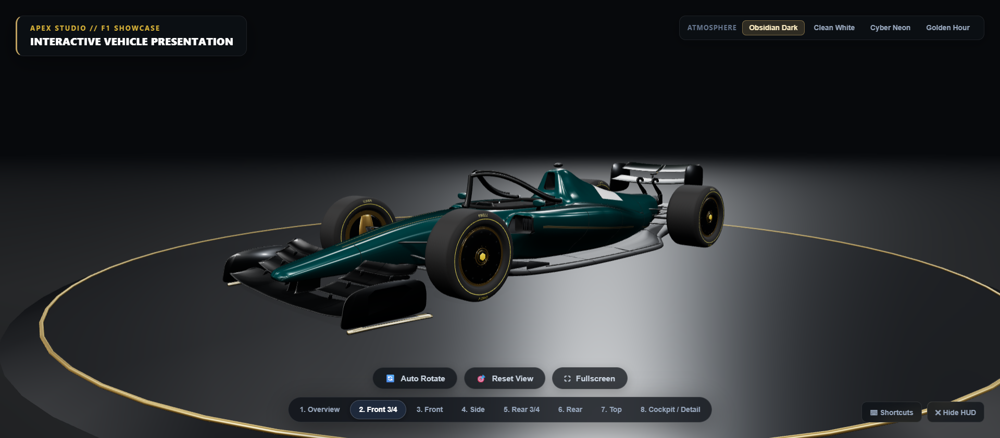 | 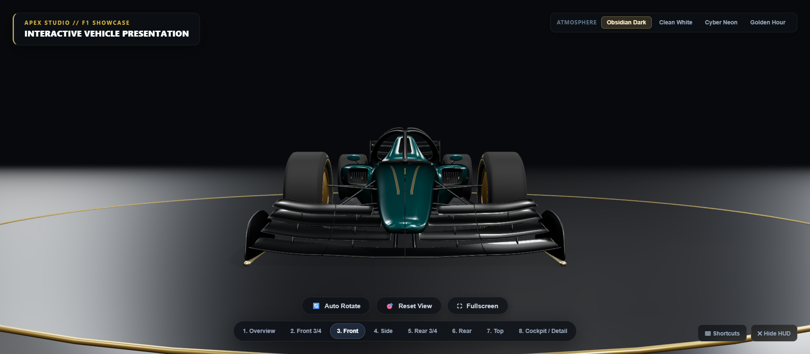 |

| Side Profile Elevation | Rear 3/4 Diffuser |
| :---: | :---: |
| 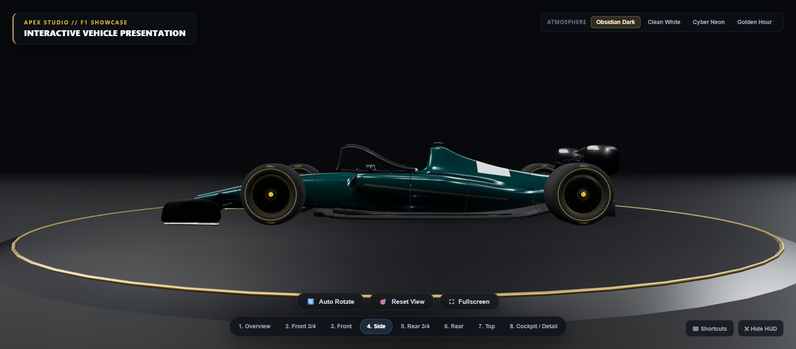 | 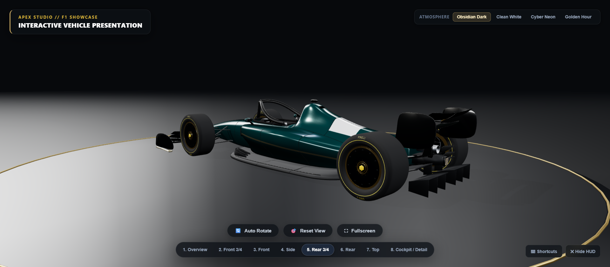 |

| Direct Rear Exhaust | Top Plan View |
| :---: | :---: |
| 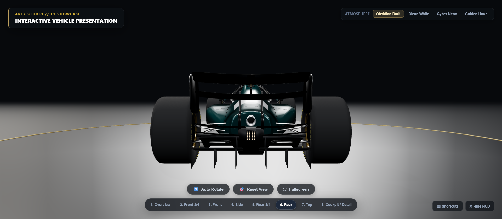 | 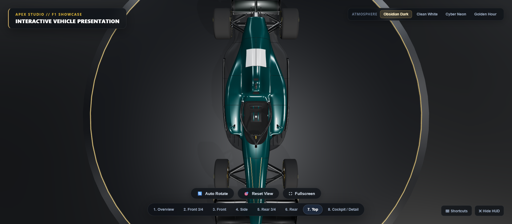 |

### Cockpit & Interior Macro

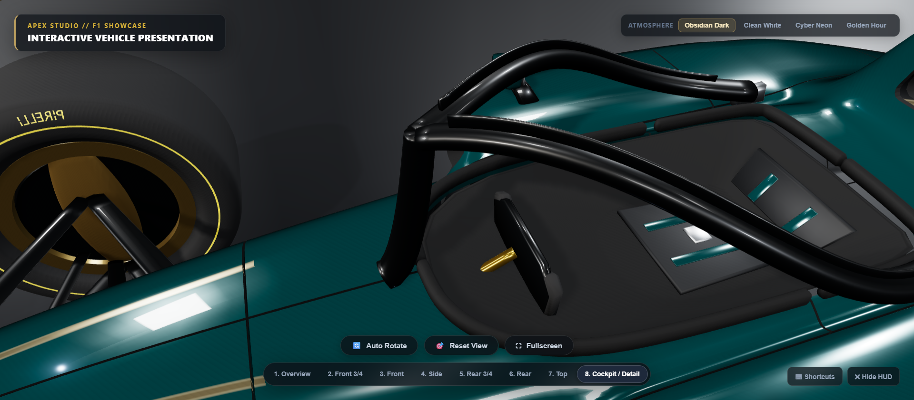

---

## Lighting Presets (Atmospheres)

The showcase features 4 balanced lighting environments:

| Environment | Key Light | Fill / Ambient | Floor Presentation |
| :--- | :--- | :--- | :--- |
| **Obsidian Dark** | Softbox Key (`2.2` intensity, `#FFFAF2`) | Cool ground bounce + Rim (`#EDF2F7`) | Matte dark granite with Champagne Gold accent ring |
| **Clean White** | High-key neutral diffuse (`1.8` intensity) | Bright white fill cyc (`#D6DBE0`) | Reflective studio cyc floor |
| **Cyber Neon** | Cold blue key (`#DDEEFF`) | Electric cyan rim (`#00D4FF`) & magenta kicker (`#E0006A`) | Deep black floor with vibrant colored reflections |
| **Golden Hour** | Warm sunset key (`#FFD8AA`) | Warm amber bounce (`#FFA038`) & sky blue rim | Warm dusk showroom tone |

### Atmospheres Gallery

| Obsidian Dark Studio | Clean White Cyc |
| :---: | :---: |
|  | 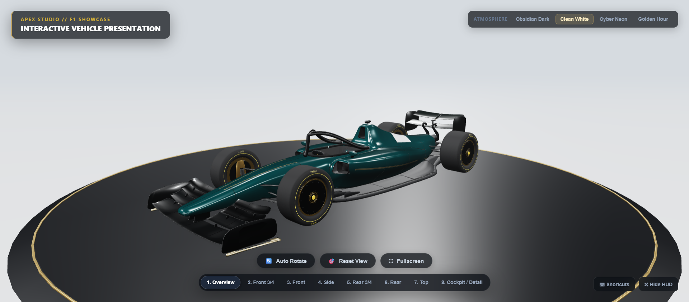 |

| Cyber Neon Night | Golden Hour Sunset |
| :---: | :---: |
| 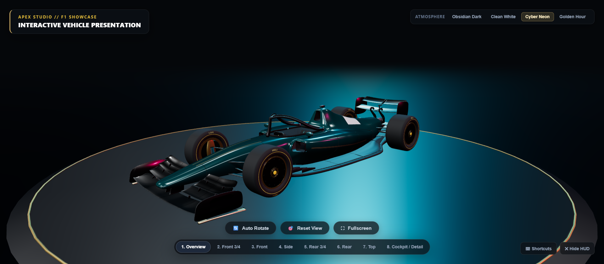 | 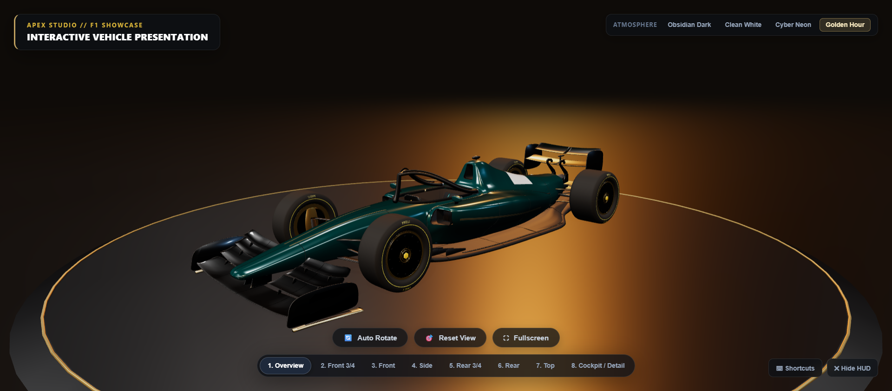 |

---

## 3D Vehicle Model Specifications

- **Asset File:** `public/models/Ferrari_F1_Clean.glb`
- **Total Mesh Count:** 191 distinct mesh nodes across 81 parent objects.
- **Unique Materials:** 17 calibrated PBR material slots.
- **Physical Scale:**
  - Length: `5.47 m`
  - Width: `2.11 m`
  - Height: `1.01 m`
- **Ground Clearance:** Grounded at `Y = 0.080 m` (tire contact patches rest flush on top of the showroom dais plinth without clipping or floating).
- **Shadow Quality:** 2048 x 2048 PCF soft shadow maps with depth bias calibration (`bias: -0.0003`, `normalBias: 0.025`).

---

## Performance & Quality Assurance

- **Target Framerate:** 60 FPS on modern desktop browsers (Chrome, Edge, Firefox, Safari).
- **Draw Calls:** Optimized single-pass rendering with shared PBR shader programs.
- **Color Pipeline:** `THREE.SRGBColorSpace` with `THREE.ACESFilmicToneMapping` for high dynamic range photographic fidelity.
- **Build Check:** `npm run build` exits with code 0 (clean distribution generation).
- **Codebase Lint:** `npm run lint` exits with code 0 (100% clean syntax and model hash verification).
- **Browser QA:** Verified in Chromium via DevTools with 0 console errors, 0 runtime warnings, and 0 failed HTTP requests.

---

## License & Intellectual Property Notice

This software and web showcase application is created for educational, portfolio, and non-commercial demonstration purposes. 

The Formula 1 car design and associated aerodynamic concepts are the intellectual property of their respective trademark holders. No commercial affiliation, sponsorship, or endorsement is implied.
